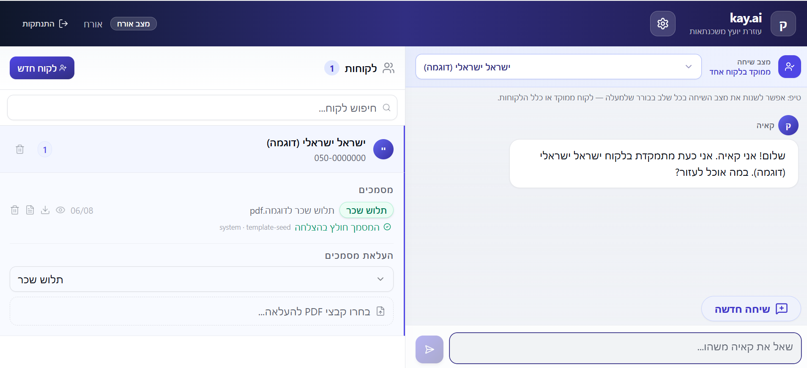
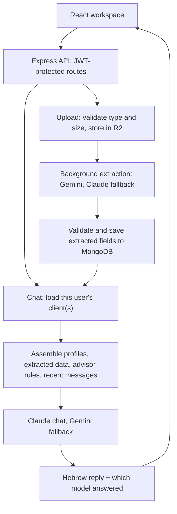

# MortgageAdvisor | kay.ai

A Hebrew-first workspace for mortgage advisors: manage clients, extract data from their documents, and ask questions answered only from the information on file.

<!-- TODO: keep only if accurate -->
In production with a paying pilot customer (a mortgage consultant).

Built by [Yehuda Kahana](https://github.com/yehudakahana) — React + TypeScript frontend, tenant-scoped Express API, private document storage on R2, and two AI providers with cross-provider fallback.

## Live demo

**[Open the demo](https://mortgage-advisor.yehuda-kahana.workers.dev)** → choose **"כניסה כאורח" (Continue as guest)**. No sign-up. UI and replies are in Hebrew.

1. Open the sample client and review its documents and extracted fields.
2. Ask about a value in the documents — then ask about one that's missing. It should say it doesn't know instead of inventing a number.
3. Switch between one-client and all-clients chat, or upload a synthetic PDF.

Guest accounts last 24 hours with limited quotas (20 messages, 5 uploads). **Use synthetic data only.**

<!-- TODO: add docs/images/workspace-screenshot.png, then uncomment:

-->

## Eval results

Hand-labeled suite: 40 cases (30 chat, 10 extraction documents with 40 labeled fields), 8 of them held out. Each case runs 3 times.

| Category | Pass rate | What it measures |
| --- | ---: | --- |
| Extraction (per field) | XX% | Correct value extracted from the document |
| Chat: answerable | XX% | Correct answer from the client's data |
| Chat: unanswerable | XX% | Refuses instead of hallucinating |
| Chat: adversarial | XX% | Resists injected instructions in documents/prompts |
| Holdout (all categories) | XX% | Cases not used while tuning prompts |

<!-- TODO: fill from one full run + holdout run -->
Run on `claude-sonnet-4-6` / `gemini-2.5-flash`, YYYY-MM-DD. Scoring details: [`backend/evals/README.md`](backend/evals/README.md).

## Architecture

| Layer | Implementation |
| --- | --- |
| Frontend | React 18, TypeScript, Vite, Tailwind CSS, Radix UI — Cloudflare Workers |
| API | Express + TypeScript on Node.js — Railway |
| Data | MongoDB (Mongoose); original files in private Cloudflare R2 |
| Extraction | Gemini first, Claude fallback |
| Chat | Claude first, Gemini fallback |
| Auth | bcrypt + JWT with token-version revocation; isolated guest accounts |
| Testing | Vitest, Supertest, MSW, Playwright, LLM eval harness |

Key decisions:

- **Direct context assembly, not vector RAG.** An advisor's client file is small enough to fit in context, so extracted data is passed to the model directly (capped per document and in total). No embedding pipeline to maintain.
- **Model per task, with fallback.** Gemini handles multimodal extraction; Claude handles chat. If one provider fails, the other takes over, and the UI shows which model answered.
- **Grounding is measured, not assumed.** Refusal on missing data and resistance to injected instructions are separate eval categories with holdout cases.
- **Tenant scoping at the query level.** Every client, chat-context, and file lookup is scoped to the authenticated user; file URLs are signed and short-lived.

## Limitations

- **No retrieval layer.** Context is truncated at fixed limits, which works for a single advisor's clients but won't scale to large document collections.
- **Extraction runs in-process.** No durable job queue; an interrupted process can leave an extraction incomplete (manual re-extract is available).
- **The eval set is small and synthetic.** It tracks regressions; it isn't a benchmark of real Hebrew scans or handwriting.

## More

- [Local setup and deployment](docs/SETUP.md)
- [Tests and evals](docs/SETUP.md#tests-and-evals)
- [Security and data handling](SECURITY.md)
- [Offline testing](OFFLINE_TESTING.md)
